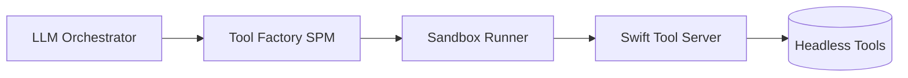

# FountainAI Tool Sandbox (Ubuntu) — Requirements & Implementation Paper
> **Legacy:** Retained for historical reference after sandbox tooling was removed.
**Version:** 0.9 (August 18, 2025)  
**Audience:** Architecture/Platform, Tooling, Security, CI/Deploy, and LLM Gateway / reasoning engine stakeholders
**Authors:** FountainAI Platform (with GPT-5 Pro)  
**Status:** Draft for internal review

---

## 1) Executive Summary

We will provide a **Swift‑centered sandbox** that hosts a **Tool Server** on Ubuntu, exposing a **growing catalog of headless tools** behind **OpenAPI 3.1**. The LLM orchestrator (via the Gateway—Codex or any capable model) interacts **only** with typed Swift clients generated from the OpenAPI, keeping the **orchestration path 100% Swift** and **free of Docker** and host toolchain side‑effects.

Two sandbox backends are supported:
- **Namespaces backend (Linux)** via `bubblewrap` (preferred) or `proot`.
- **Micro‑VM backend (macOS/Linux)** via `QEMU` (snapshot boot), for hosts that lack unprivileged namespaces or that prefer stronger isolation.

This paper specifies: scope, constraints, threat model, functional & non‑functional requirements, architecture, API shape, packaging, licensing compliance, CI/CD, and acceptance tests.

---

## 2) Scope & Goals

### In‑scope
- A **portable Ubuntu image** (rootfs or qcow2) with Swift 6 and curated tools (ImageMagick, ffmpeg, exiftool, pandoc, libplist; optional: Csound, LilyPond).
- A **Swift Tool Server** (no Vapor required; pure Swift NIO) exposing **OpenAPI** endpoints that wrap tools in a safe, deterministic manner.
- A **Swift host facade** (“FountainAI Tool Factory” SPM package) offering **typed API clients** + a **SandboxRunner** (bwrap/proot or micro‑VM).
- **Strict isolation policy**: read‑only source mounts, write‑only scratch area, disabled network by default, resource limits.
- **Determinism**: versioned artifacts, pinned toolchain, checksummed images, reproducible builds.
- **Observability**: structured logs, request IDs, basic metrics & health checks.

### Out‑of‑scope (initially)
- GPU passthrough and hardware codecs.
- Windows host support.
- Long‑running background daemons inside the sandbox (the Tool Server is process‑local).

---

## 3) Constraints & Assumptions

- **Swift-only orchestration**: repository modules rely on Swift NIO and `Process` APIs—no shell in the execution path.
- **No Docker dependency**: the sandbox runs on the host via `bubblewrap`, `proot`, or QEMU without requiring a Docker daemon.
- **Typed boundaries via OpenAPI**: versioned specs live under `openapi`, with generated Swift clients and server stubs in `Sources/openapi/Generated` for type-safe calls.
- **Pluggable LLM orchestrator**: the LLM Gateway coordinates requests using Codex or any compatible model; the Tool Factory remains a library invoked by the orchestrator.
- **Reproducible artifacts**: rootfs/QCOW images are checksum‑pinned and dependencies are versioned in `Package.swift` for deterministic builds.
- **Licensing compliance**: GPL/LGPL tools are included only with attribution and source‑offer, adhering to repository policies.

---

## 4) FIT‑Check Against FountainAI Architecture

| Guardrail / Decision | Fit Assessment | Notes |
|---|---|---|
| Pure Swift orchestration (no shell in path) | **Strong Fit** | Host uses SPM package + Swift Process to run sandbox; Tool Server is Swift. |
| No Docker | **Strong Fit** | bwrap/proot or QEMU micro‑VM; no daemon. |
| OpenAPI‑typed interfaces | **Strong Fit** | Tool Server publishes OAS 3.1; clients generated with Swift toolchain. |
| Deterministic, Git‑tracked artifacts | **Strong Fit** | Image manifest (checksums), generated clients committed. |
| Pluggable LLM orchestration | **Strong Fit** | Tool Factory is a library; LLM Gateway drives the loop (Codex by default). |
| Minimal host impact | **Strong Fit** | No tool install on host; read‑only mounts; isolated build cache. |
| macOS parity via Ubuntu equivalents | **Good Fit** | Canonical mapping (e.g., `sips`⇒ImageMagick, `afconvert`⇒ffmpeg). Some options differ; API normalizes. |
| Security hardening | **Good Fit** | User namespaces or VM isolation; cgroups; network off by default; seccomp (optional). |
| “Tool Factory” presence in `codex-deployer` repo | **Unconfirmed** | Repo is visible, but page didn’t render via my browser tool; we’ll implement as a standalone SPM and wire it into `codex-deployer`. |


## 5) System Context

```

+-------------------------------+          +--------------------------------------+
| LLM Orchestrator via Gateway  |  Swift   |     FountainAI Tool Factory          |
|   (Codex or compatible LLM)   |<-------> | (SPM: SandboxRunner + API Client)    |
+-------------------------------+          +--------------------------------------+

                (boot/exec)
                     |
                     v
+-------------------------------+
|         Ubuntu Sandbox        |
|   (bwrap/proot or micro-VM)   |
|       Swift Tool Server       |
|         Headless tools        |
+-------------------------------+
                     |
                     v
+-------------------------------+
|       Outputs / Artifacts     |
+-------------------------------+
```




## 6) Functional Requirements (FR)

**FR‑1 Sandbox lifecycle**

- Start sandbox with a named image (e.g., `swift-6.0.1-ubuntu22.04`).
- Health‑check endpoint `GET /_health` must return within 500ms.
- Stop sandbox cleanly and remove temp mounts.

**FR‑2 Tool discovery**

- `GET /_manifest` returns JSON with tool list, versions, and supported operations.

**FR‑3 Tool execution**

- Each tool operation is an OpenAPI `POST` that:
  - Accepts input as JSON + (optionally) multipart file streams.
  - Runs the tool with validated arguments.
  - Streams logs (Server‑Sent Events) **or** collects logs and returns them with the result.
  - Returns strict, typed result models (bytes or URLs of artifacts).

**FR‑4 Filesystem policy**

- Read‑only bind mounts for inputs; dedicated writable scratch (`/work`) per request.
- All outputs live under `/work/out` and are returned to caller or exported to a temporary host folder managed by the Tool Factory.

**FR‑5 Resource policy**

- Per‑operation limits: CPU time, memory, wall time; default timeouts (e.g., 60s).
- Network disabled unless a tool operation opts‑in (`network: true`).

**FR‑6 Observability**

- Correlate every request with a `x-request-id`.
- Emit structured JSON logs; include timing, exit status, stderr digest.

**FR‑7 Error model**

- Map tool exit codes to typed problem responses; preserve stderr (bounded to 64KB).

---

## 7) Non‑Functional Requirements (NFR)

- **NFR‑1 Determinism**: identical inputs produce identical outputs (modulo timestamps), enforced through parameter normalization and fixed seeds where applicable.
- **NFR‑2 Performance**: cold boot ≤2s (micro‑VM snapshot) or ≤150ms (bwrap) target; typical image ops ≤500ms for small assets.
- **NFR‑3 Portability**: Linux host (namespaces) and macOS host (micro‑VM).
- **NFR‑4 Security**: least‑privileged, user namespaces or VT‑isolated VM; no host tool lookups.
- **NFR‑5 Compliance**: license files packaged; GPL obligations observed (source offer/build scripts).
- **NFR‑6 Upgradability**: images are semantic‑versioned; manifest allows side‑by‑side versions; rollback is a manifest switch.

---

## 8) Tool Catalog (Initial)

| macOS Habit | Ubuntu Tool | OpenAPI Tag / Operation |
|---|---|---|
| `sips` image ops | ImageMagick (`magick`) | `image.convert`, `image.resize`, `image.info` |
| `afconvert` | ffmpeg | `audio.transcode`, `audio.info` |
| `textutil` | pandoc | `text.convert` (md↔pdf/html/rtf/txt) |
| `plutil` | libplist | `plist.convert`, `plist.validate` |
| metadata (`mdls`) | exiftool | `metadata.read`, `metadata.write` |
| (optional) Csound | libcsound | `csound.perform` |
| (optional) LilyPond | lilypond | `lilypond.render` |

We normalize disparate CLIs to a coherent, typed API. Optional tools are gated by license comfort and image size budgets.

---

## 9) API Shape (OpenAPI 3.1 Excerpts)

```
openapi: 3.1.0
info:
  title: FountainAI Tool Server
  version: "1.0.0"

paths:
  /_manifest:
    get:
      summary: Return manifest of available tools
      responses:
        "200":
          description: Successful manifest response
          content:
            application/json:
              schema:
                type: object
                properties:
                  image:
                    type: string
                  tools:
                    type: array
                    items:
                      type: object
                      properties:
                        tag:
                          type: string
                        version:
                          type: string
                        ops:
                          type: array
                          items:
                            type: string

  /image/convert:
    post:
      summary: Convert images using ImageMagick
      requestBody:
        required: true
        content:
          multipart/form-data:
            schema:
              type: object
              required: [input, toFormat]
              properties:
                input:
                  type: string
                  format: binary
                toFormat:
                  type: string
                  enum: [png, jpg, webp, pdf, tiff]
                width:
                  type: integer
                  minimum: 1
                  nullable: true
                height:
                  type: integer
                  minimum: 1
                  nullable: true
      responses:
        "200":
          description: Converted image bytes
          content:
            application/octet-stream: {}
        "422":
          description: Validation error
        "500":
          description: Tool execution failed

  /lilypond/render:
    post:
      summary: Render LilyPond source into PDF/SVG/MIDI
      requestBody:
        required: true
        content:
          application/json:
            schema:
              type: object
              required: [ly]
              properties:
                ly:
                  type: string
                  description: LilyPond source
                outputs:
                  type: array
                  items:
                    type: string
                    enum: [pdf, svg, midi]
      responses:
        "200":
          description: Rendered LilyPond outputs
          content:
            application/json:
              schema:
                type: object
                properties:
                  pdf:
                    type: string
                    format: byte
                    nullable: true
                  midi:
                    type: string
                    format: byte
                    nullable: true
                  svg:
                    type: array
                    items:
                      type: string
                      format: byte
                  log:
                    type: string
```
---
    
## 10) Host‑Side SPM Layout

```
FountainToolFactory/                 # SPM Package
├─ Package.swift
├─ Sources/
│  ├─ FountainToolFactory/           # Public facade
│  │  ├─ ToolFactory.swift           # boot/shutdown, typed clients
│  │  ├─ SandboxSpec.swift
│  │  ├─ SandboxRunner.swift         # protocol
│  │  ├─ BwrapRunner.swift           # Linux
│  │  ├─ ProotRunner.swift           # Fallback
│  │  ├─ MicroVMRunner.swift         # macOS/Linux via QEMU
│  │  └─ Clients/                    # Generated from OpenAPI (kernel)
│  └─ FountainToolModels/            # Shared DTOs/enums generated
└─ Plugins/
   └─ PrepareSandboxPlugin/          # downloads & verifies image manifest
   
```


Host usage sketch:

```

import FountainToolFactory

let tf = try ToolFactory(snapshot: "swift-6.0.1-ubuntu22.04")
try tf.boot()

let img = tf.clients.image
let pngBytes = try img.convert(.data(jpegData), to: .png, width: 1024, height: nil)

try tf.shutdown()
```

### Build Commands

```bash
# Build the sandbox image with bundled tools
./scripts/build-sandbox-image.sh swift-6.0.1-ubuntu22.04

# Compile the Swift packages
swift build -c release
```

### API Example

```bash
# Invoke the Tool Server directly
curl -X POST http://localhost:8080/image/convert \
  -F input=@input.jpg \
  -F toFormat=png \
  -F width=1024 > out.png

# Discover available tools
curl http://localhost:8080/_manifest
```


⸻

## 11) In‑Sandbox Tool Server (Swift NIO)

### Responsibilities

    •    Validate requests (JSON Schema derived from OpenAPI).
    •    Map to a tool adapter (e.g., ImageMagickAdapter).
    •    Prepare /work, run tool with posix_spawn/Process (no shell), capture stdout/stderr.
    •    Stream logs (optional SSE) and return typed result.

### Key modules

    •    Router.swift (static routes from OAS).
    •    Validation.swift (input typing).
    •    ToolAdapters/ (ImageMagick, ffmpeg, etc.).
    •    SandboxPolicy.swift (limits, env, working dirs).
    •    Observability.swift (structured logs).

⸻

## 12) Isolation & Limits

### Namespaces backend (preferred on Linux)

    •    bwrap:
    •    --ro-bind inputs, --bind scratch, --unshare-net (default).
    •    Minimal /proc, /dev nodes; --die-with-parent.
    •    cgroups v2:
    •    memory.max, cpu.max, pids.max per request.
    •    (Optional) seccomp profile for common tools (block execve of unknown paths).

### Micro‑VM backend (macOS & Linux)

    •    qemu-system-x86_64 / -accel hvf on macOS, /dev/kvm on Linux.
    •    Snapshot boot, 9p or virtiofs shared mount of a temporary host directory.
    •    Port‑forward to expose Tool Server only to 127.0.0.1 on host.

### Defaults

    •    Network: off (per‑operation allow‑list).
    •    Timeouts: 60s (override per op).
    •    I/O: 256MB per request cap unless extended.

⸻

## 13) Image Packaging & Manifest

### Rootfs (namespaces): 

squashfs or directory image with /opt/swift, /opt/tools.

### Micro‑VM: 

qcow2 (Ubuntu 22.04) with cloud‑init seed for one‑shot Tool Server bootstrap.

**tools.json** manifest example

```
{
  "image": "swift-6.0.1-ubuntu22.04",
  "checksum": "sha256:…",
  "tools": [
    {"tag":"image","version":"ImageMagick 7.1.1-34","ops":["convert","resize","info"]},
    {"tag":"audio","version":"ffmpeg 6.1.1","ops":["transcode","info"]},
    {"tag":"metadata","version":"exiftool 12.76","ops":["read","write"]}
  ],
  "oas": "/openapi.yaml"
}
```

⸻

## 14) Compliance & Licensing Strategy

    •    Include license texts for each packaged tool.
    •    Provide build scripts or references to upstream source consistent with GPL/LGPL obligations (ffmpeg/LilyPond).
    •    Prefer dynamic linking with clear notice where applicable.
    •    Document codec availability (e.g., H.264 patent/licensing caveats).

⸻

## 15) Observability, Logging, and Auditing

    •    Structured JSON logs at host and server layers with request_id.
    •    Emit tool, args_hash, duration_ms, exit_code.
    •    Optional OpenTelemetry spans (host facade exports spans; Tool Server adds child spans).
    •    Audit trail: keep only digests of inputs by default; raw inputs may be large/sensitive.

⸻

## 16) Testing & Acceptance Criteria

### Unit

    •    Adapters validate argv formation; fake Process returns deterministic output.

### Integration

    •    Boot sandbox, run /_health, /_manifest.
    •    Golden tests: image resize, audio transcode, plist convert.
    •    ./scripts/run-tests.sh builds and runs coverage tests.

### Security

    •    Attempt to write outside /work ⇒ must fail.
    •    Attempt network fetch when disabled ⇒ must fail.
    •    Memory pressure ⇒ clean tool termination with 137/oom mapping.

### Performance

    •    Cold bwrap start ≤150ms; micro‑VM snapshot ≤2s.
    •    1MB JPEG → 1024px PNG ≤500ms.

## Acceptance Checklist

    •    ✅ OAS generated clients compile and pass smoke tests.
    •    ✅ No host toolchain changes required.
    •    ✅ Network‑off default enforced.
    •    ✅ License compliance validated via docs/licensing-matrix.md and scripts/verify-licenses.sh.

> © 2025 Contexter alias Benedikt Eickhoff 🛡️ All rights reserved.
